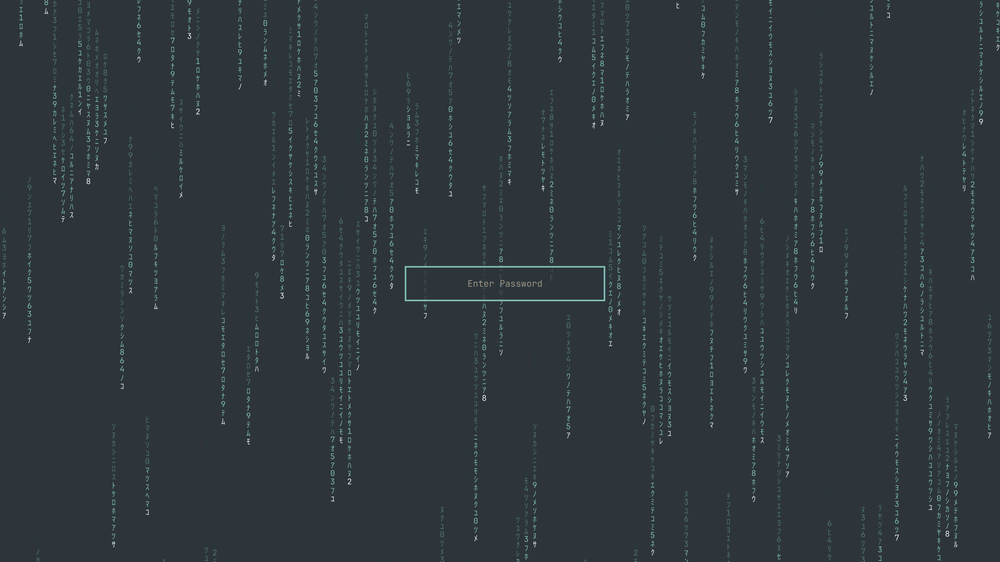

# Matrix Lock

Draws the [Matrix Rain](https://github.com/nzkritik/omarchy-matrix-rain) effect
on the [Omarchy](https://omarchy.org/) lock screen, and tells you when an
Omarchy update has left it out of date.



Preview it without locking yourself out with `omarchy-shell lock preview`.

## Requires Matrix Rain as your wallpaper

This plugin is a companion to
[Matrix Rain](https://github.com/nzkritik/omarchy-matrix-rain), and the lock
screen follows your desktop:

| Your wallpaper | The lock screen shows |
| --- | --- |
| Matrix Rain | the rain, in your theme's accent colour |
| anything else | Omarchy's stock blurred wallpaper, unchanged |

So install Matrix Rain and pick it in the background picker (Style ›
Background), or the lock screen will look exactly as it does without this
plugin. `omarchy-matrix-lock status` tells you which of the two the lock will
show right now.

Stock Omarchy has no separate setting for the lock screen. It takes its colours
from your theme and its background from your wallpaper, and following the
wallpaper keeps it that way.

## Install

```bash
omarchy plugin add https://github.com/nzkritik/omarchy-matrix-lock --enable
ln -s ~/.config/omarchy/plugins/nzkritik.matrix-lock/bin/omarchy-matrix-lock ~/.local/bin/
omarchy-matrix-lock install
omarchy restart shell
```

Then select Matrix Rain as your wallpaper (see above).

Adding the plugin changes nothing by itself: your lock screen is only cloned
and patched when you run `install`. If you add it and skip that step, it tells
you once, in a notification with the exact command, and never again.

```bash
omarchy-matrix-lock status      # what is installed, and what the lock will show
omarchy-matrix-lock sync        # after an Omarchy update, or after updating this plugin
omarchy-matrix-lock uninstall   # put the stock lock screen back
omarchy-matrix-lock check       # quiet; exit 0 current, 3 stale, 1 not installed
```

**Upgrading from 1.0:** run `omarchy-matrix-lock sync` after updating (the
plugin reminds you), because the clone needs the new renderer files copied in.

## GPU rendering, with a CPU fallback

The rain is drawn by one fragment shader. Every column is a function of time
worked out on the GPU, over a texture of the glyphs rendered once from ordinary
text, so the CPU only advances a clock, 30 times a second.

| Renderer | File | CPU at 1920x1080 | Used when |
| --- | --- | --- | --- |
| GPU | `MatrixRainGpu.qml`, `rain.frag` | about 2% of a core | the scene graph is hardware accelerated (normally) |
| CPU | `MatrixRainCpu.qml` | about 25% of a core | a software scene graph, or the shader fails to load |

`MatrixRain.qml` picks between them by itself. Both look the same, and a fall
back is logged once to the journal as
`matrix rain: shader unavailable, falling back to the CPU renderer`.

Qt 6 only loads precompiled shaders, so `rain.frag.qsb` (`rain.frag` built by
Qt's `qsb`) is committed alongside its source. `tools/build-shaders.sh` rebuilds
it byte for byte, so anyone can check the binary matches the source.

The renderer is self-contained: the `MatrixRain*.qml` files and the shader ship
here and are copied into the clone, rather than loaded from the Matrix Rain
plugin. Matrix Rain decides *whether* the lock shows rain, never *how* it is
drawn, so updating or removing it can never break your lock screen. Without it,
the lock screen just stays stock.

## What it does to your system

Omarchy's lock screen is a `WlSessionLock` surface, and a session lock covers
every layer-shell surface on the output — so a wallpaper overlay cannot show
through it, and the rain has to be drawn inside the lock screen's own QML. The
supported way to change a built-in plugin is `omarchy plugin clone`, so
`install` clones `omarchy.lock` to `<user>.lock` and patches the clone.

`LockView.qml` is regenerated from the lock screen **you have installed** each
time you run `install` or `sync`, rather than shipping a frozen copy, and every
patch anchor must match exactly once or the edit is refused rather than
half-applied. `Service.qml` — the whole password and fingerprint PAM flow — is
left exactly as cloned.

Two things to know before you install it:

- **The clone stops tracking upstream.** Your lock screen will not pick up fixes
  to `omarchy.lock`, security ones included, until you run `sync`. This is why
  the plugin ships a service at all: it records which stock `LockView.qml` the
  clone was generated from, and notifies you on the next shell start after that
  file changes. That is the notification you get after `omarchy update`.
- `uninstall` removes the clone outright only when nothing of yours would go
  with it — otherwise it restores `LockView.qml` and leaves your clone in place.

## Handling untrusted paths

The output of this script becomes a lock screen, so the paths it touches get
more care than a wallpaper would need.

- The stock `LockView.qml` is resolved from a fixed `/usr/share/omarchy`, never
  from `$OMARCHY_PATH` — the environment must not be able to redirect the file
  whose contents become your lock screen.
- Every tool is resolved from `/usr/share/omarchy/bin` and `/usr/bin` only.
  The script pins `PATH` to those two root-owned directories, and the plugin
  starts it with that `PATH`, by full path, and without `BASH_ENV`, so nothing
  earlier on an inherited `PATH` can stand in for a tool.
- The clone id comes from `id -un`, not `$USER`, and is validated as a single
  safe path component before it is used as a directory name.
- Every read of a user-writable path goes through one bounded, no-follow,
  non-blocking helper, so a symlink is refused, a planted FIFO returns instead
  of wedging the process, and a swollen file cannot be pulled in whole.
- Every write is staged in the destination directory, `fsync`ed, and committed
  with an atomic rename, after refusing any destination that is a symlink or
  not a regular file.

## Uninstall

```bash
omarchy-matrix-lock uninstall
omarchy plugin remove nzkritik.matrix-lock --yes
rm -rf ~/.local/state/omarchy-matrix-lock
rm -f ~/.local/bin/omarchy-matrix-lock
```

Take the lock screen off *first*, while this plugin is still around to do it.
Removing the plugin without that leaves the clone behind with its own copy of
`MatrixRain.qml` — that still works, but `omarchy plugin remove <user>.lock` is
then the way to undo it.

## Licence

MIT
